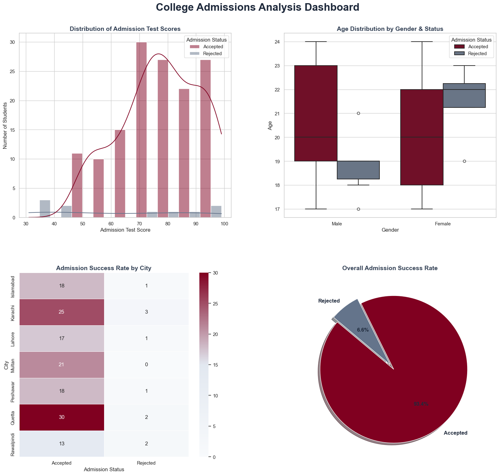

# Student Admission Analysis

A comprehensive data analytics and visualization project built using **Python**, **Pandas**, and **Seaborn** to clean, process, and analyze college admissions data.

## Features & Cleaned Insights
- **Outlier Removal:** Identified and filtered out anomalies and data entry errors (such as 0% and 4% high school percentage scores) directly within the dataframe to ensure 100% statistical accuracy.
- **Unified Visuals:**
  - *Distribution of Admission Test Scores* (Histogram with KDE)
  - *Age Distribution by Gender & Status* (Box Plot)
  - *Admission Success Rate by City* (Custom-built Burgundy Heatmap)
  - *Overall Success Rate* (Pie Chart)

## Dashboard Preview

## Tech Stack
- Python 3 (Jupyter Notebook)
- Pandas
- Matplotlib & Seaborn
